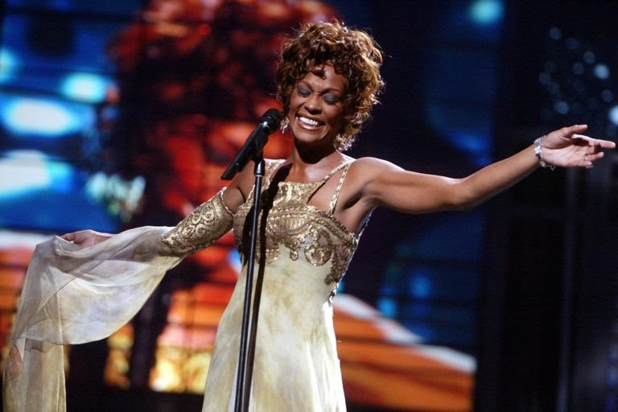

<html>
    <html lang="pt-br">
  <head>
    <meta charset="UTF-8">
    <meta name="viewport" content="width=device-width, initial-scale=1, maximum-scale=1.0">
    <title></title>
    
  </head>
       <body>
      
      <h1>Whitney Houston E As Drogas</h1>
      <i>O Dom A Fama E O Escapismo</i>
      
      
      

      <h1>O Mapa Astral</h1>

      
Como Whitney Houston foi uma artista pública seus dados são naturalmente fáceis de encontrar para fazer seu mapa natal. Cuidado com compartilhando de dados como (data de nascimento, cidade natal entre outros) em sites pouco confiáveis, verifique sempre se não se trata de golpe e fake news. 

      
Nascida em <b>9 de Agosto de 1963, às 20:55, em Newark, New Jersey, USA,</b> temos uma leonina com ascendente em peixes, o foco da análise será sobre <b>saúde</b> e os aspectos desafiadores que a cantora enfrentou com as drogas.  

        
        
          
        <i>Mapa gerado pelo site <a href="https://www.astro-seek.com/birth-chart/whitney-houston-horoscope" >Astro Seek</a></i>
        

        <h1>Casa Astrológica 6 Saúde</h1>
        
       
Whitney nasceu com sol brilhando em uma casa astrológica muito importante, nesse posicionamento é fundamental ver os aspectos que esse sol faz com outros planetas no mapa completo. Na astrologia temos uma aspecto chamado <b>quadratura </b>entre planetas que estão em signos opostos, no caso da cantora sol em Leão ( elemento fogo) em desafio a netuno em Escorpião ( elemento água)  na casa 8, uma casa muito temida por muitos por tratar de temas tabus, como sexo e morte. Netuno na astrologia rege <b>as drogas, todos os líquidos, as ilusões e o escapismo</b>, Fica claro que um envolvimento extremo  da cantora com essas substâncias e bebidas alcoólicas trariam graves problemas para sua saúde e por consequência sua carreira profissional.

         
         
         

         
Todo brilho que a cantora teve  naturalmente assim como outras pessoas do signo de leão foram afogados pelas águas profundas de netuno em escorpião, que coincide com a forma na qual ela morreu. Se você esta pensando agora " Mais se todos abusarem dessas coisas podem ter o mesmo fim", e esse pensamento não está errado, só que para algums a coisa é muito mais séria e a facilidade para isso é altíssima, exclusivamente para pessoas do <b>signo de Peixes, que possuem sol( Espírito e Essência) , lua( alma e Emoções) e ascendente (corpo e atitudes) nesse signo</b> regido pelo planeta netuno.

         
           
E sempre bom lembrar que o mapa natal revela coisas na qual vomos passar a vida inteira, como se fosse um guia de vida, além de ser uma ótima opção para se autoconhecer, saber dos seus limites, e seus maiores potênciais. Termino por aqui esta breve análise para nao estender muito a página logo abaixo um vídeo que explica mais detalhamente esses assuntos na vida de Whitney Houston.

        
          
         <h1>O Último Dia De Whitney Houston</h1>
         <i>Fonte Canal Fatos Desconhecidos</i>
     
          <iframe width="360" height="215" src="https://www.youtube.com/embed/6gX0nZdbOQ4" title="YouTube video player" frameborder="0" allow="accelerometer; autoplay; clipboard-write; encrypted-media; gyroscope; picture-in-picture; web-share" allowfullscreen></iframe> 
         
           
         

         <a href="https://vitordev01.netlify.app/"
© Vitor Oliveira | Github pages 2023
</a>
      </body>
</html>
